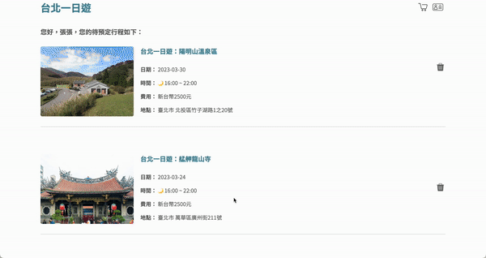
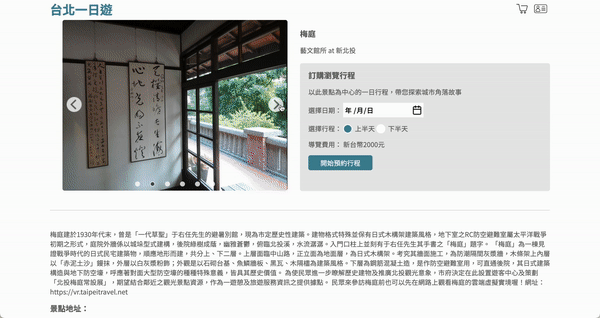
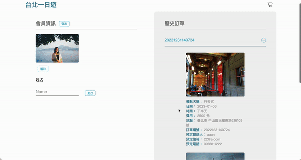
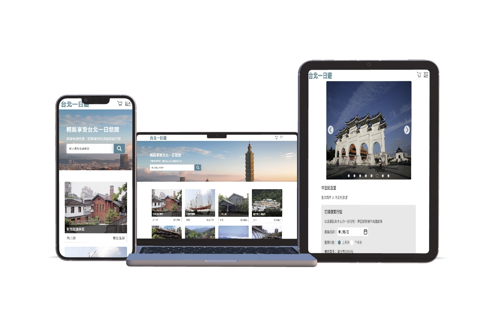

# Taipei-day-trip-website

Taipei Day Trip is an e-commerce website that offers over 50 travel destinations for users to choose from. It provides services for users to book multiple attractions and make online payments.

Test Account:
| Account | Password |
| --------------- | -------- |
| test@test.com | test123 |

Test Card:
| Card number | Expiry | CVC |
| --------------- | -------- | -------- |
| 4242 4242 4242 4242 | 01/24 | 123 |

## Table of Contents

- [Taipei-day-trip-website](#taipei-day-trip-website)
  - [Table of Contents](#table-of-contents)
  - [Main Features](#main-features)
  - [Front-end Technique](#front-end-technique)
  - [Back-end Technique](#back-end-technique)
    - [Framework](#framework)
    - [Database](#database)
  - [Cloud Service](#cloud-service)
  - [Third Party Payment](#third-party-payment)
  - [Contact](#contact)

## Main Features

- Infinite Scroll
   
  
   
- keyword Search
   
  
   
- Shopping Cart
   
  

- Carousel Slider
   
  
- Order History
   
  
- RWD
   
  Support desktop, tablet, and mobile devices.
   
  

## Front-end Technique

- Created Infinite Scroll and Carousel Slider by pure JavaScript.
- Supported RWD by using CSS Media Queries, Flex and Grid.
- Applied AJAX to fetch RESTful APIs from back-end.

## Back-end Technique

### Framework

- Python Flask

### Database

- MySQL
 

## Cloud Service

- AWS EC2 (Ubuntu)
- AWS S3

## Third Party Payment

- TapPay

## Contact

Shu-Ting, Chang
 
📩 Email: tina8899530@gmail.com
